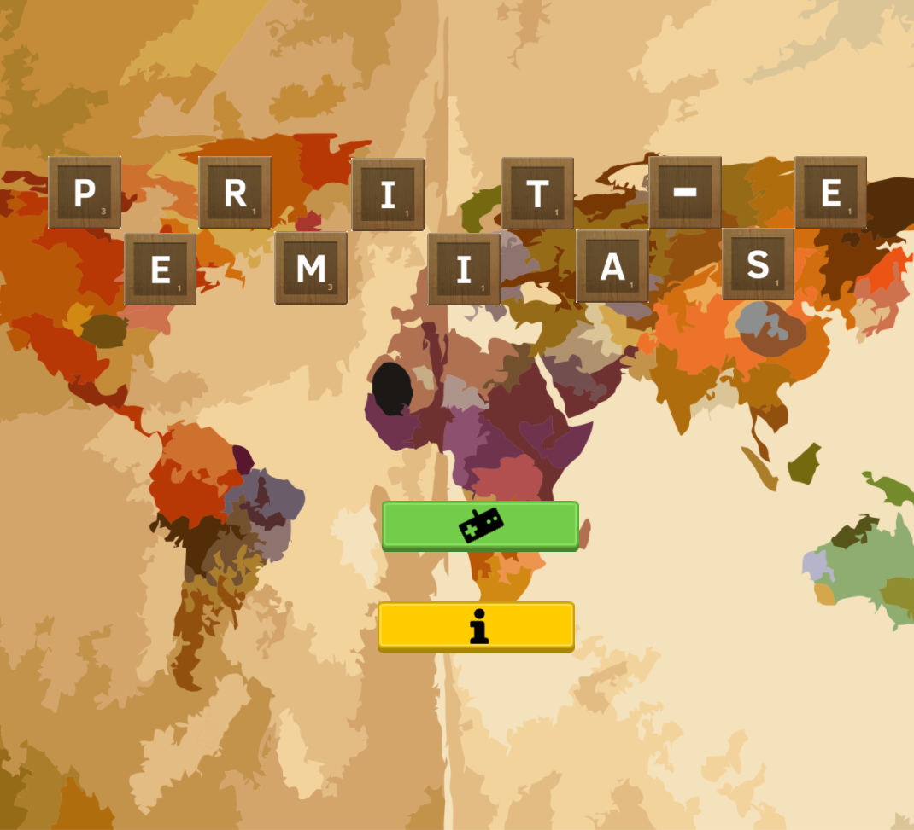
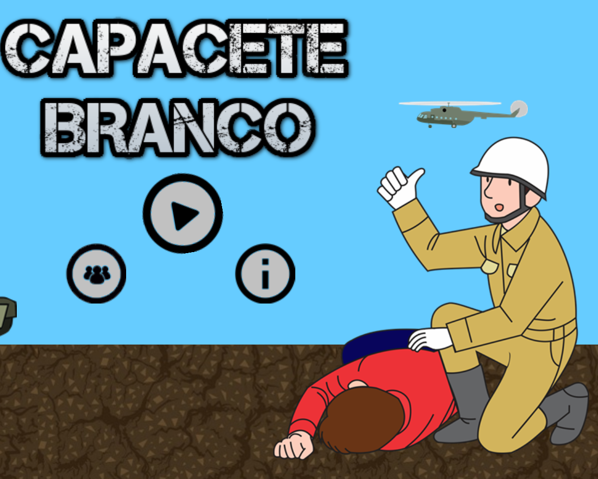
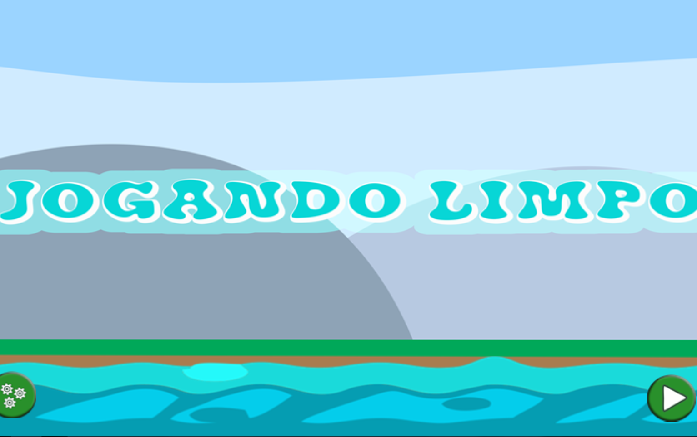
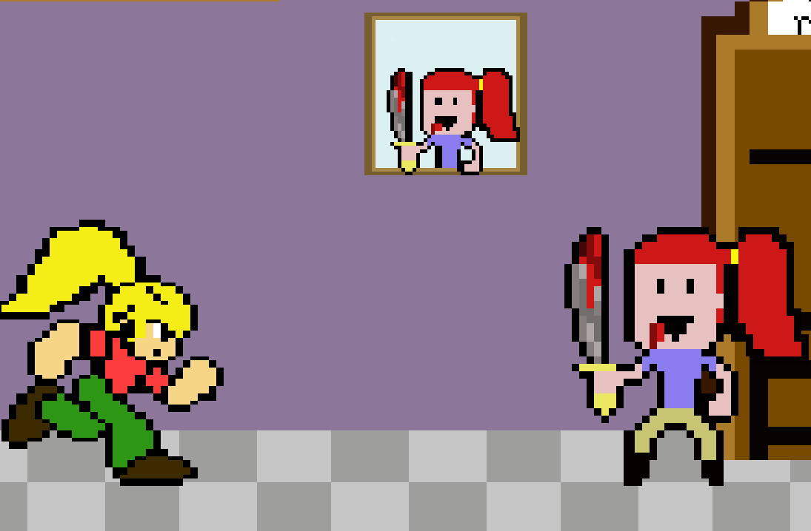

# Dados Pessoais:

**Nome:** José Victor (Zé)

**Idade:** 17 Anos

**Formação:** Programação de Jogos Digitais (Cursando)

# Portifólio

* * *

## Games

* * *

### Permita-se

* O jogo Permita-se foi desenvolvido no 1º Bimestre da matéria Oficina de Criação e tem como tema Cultura. Através do jogo, quisemos passar a mensagem que todas culturas são válidas e conhecer os elementos de cada uma é necessário. 

### Love&Code

* É um jogo que trata sobre amor, preconceito e programação. É um puzzle, que em cada ponto tem uma pista e ao desvendar essa pista, o jogador é levado até outro ponto e assim sucessivamente, até finalizar a missão. O jogo ganhou premiação de "Melhor Jogo" no 2º bimestre de Oficina de  Criação.

### Capacete Branco

* Capacete Branco retrata os desastres de um típico país em pós-guerra. Ao final, o jogador poderá fazer uma doação ao International Rescue Committee para ajudar aos países que vivenciaram/vivenciam a guerra.

### Jogando Limpo

* É um jogo educativo que contém 4 mini-games dentro dele. Foi desenvolvido para realização de um projeto orientado pelo Professor Tiago, o mesmo será utilizado como ferramenta para ensino de hidrografia.

### Micro Guerra

* O jogo “Micro Guerra” está sendo feito para crianças. O objetivo é transferir conhecimentos sobre saúde bucal.

* * *

## Mockup's

* * *

#### O Orfanato

* É um jogo que está sendo desenvolvido e tem o tema mistério. Trata da história de três amigas que saíram em uma viagem de carro pelo mundo e resolvem parar, porque estava chovendo, em uma casa abandona e lá vão passar por situações assutadoras.

* * *

# Artes

* * *

* * *

## Apresentações

* * *

* Secitex 2015 - Campus Santa Cruz

* Secitex 2016 - Campus Parnamirim

* V Expotec - Campus Apodi

* I Expotec - Campus Ceará-Mirim

* III Semana do Meio Ambiente de Ceará-Mirim

* III Encontro de Informática do Agreste Potiguar

* * *

## Contatos

* * * 

* **Instagram:** [@zevictorferreira](https://www.instagram.com/zevictorferreira/?hl=pt-br)
* **Facebook:** [Victor Ferreira](https://www.facebook.com/victor.gatopb)
* **GitHub:**  [ZeVictor](https://github.com/ZeVictor)

